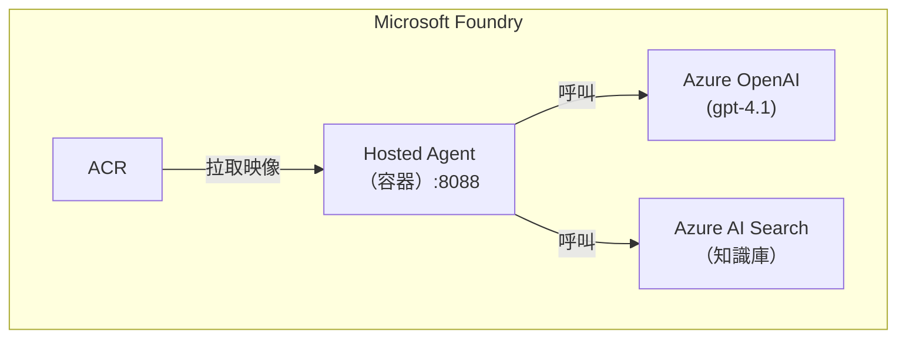

# 將 Agent Framework Agent 容器化並部署至 Microsoft Foundry

把你的 [Agent Framework](https://github.com/microsoft/agent-framework) Agent 包進 Docker 容器，推上 Azure Container Registry，再透過 [Microsoft Foundry](https://learn.microsoft.com/en-us/azure/foundry/agents/concepts/hosted-agents) 以受管理服務的方式運行。

> 內附的 HR Agent 僅為範例，你可以替換成任何 Agent Framework Agent。

---

## 目錄

1. [運作原理](#運作原理)
2. [先決條件](#先決條件)
3. [本機測試](#本機測試)
4. [部署到 Foundry](#部署到-foundry)
5. [換成你自己的 Agent](#換成你自己的-agent)
6. [專案結構](#專案結構)
7. [核心概念](#核心概念)
8. [參考資料](#參考資料)

---

## 運作原理

Hosted Agent 就是一個 Docker 容器，裡面跑著 HTTP 伺服器。Foundry 幫你管擴縮、身分識別和網路 — 你只要給它一個容器映像。

核心是 **Hosting Adapter**（`from_agent_framework()`），它把你的 `ChatAgent` 包成 HTTP 伺服器：

```
你的 ChatAgent  →  from_agent_framework(agent).run()  →  HTTP 伺服器 (:8088)
                                                           ├── POST /responses   （收發訊息）
                                                           └── GET  /readiness   （健康檢查）
```

流程：Foundry 把使用者訊息送到 `POST /responses` → Agent 處理 → 回應從同一端點回傳。




---

## 先決條件

### 本機工具

| 工具 | 用途 |
|---|---|
| **Python 3.12+** | 執行 Agent |
| **[Azure CLI](https://learn.microsoft.com/en-us/cli/azure/install-azure-cli)** | `az login`、ACR 操作 |
| **[Docker](https://docs.docker.com/get-docker/)** | 建置容器映像 |

### Azure 資源

| 資源 | 用途 | 必要？ |
|---|---|---|
| **[Microsoft Foundry 專案](https://learn.microsoft.com/en-us/azure/foundry/foundry-portal/create-project)** | 託管 Agent、管理生命週期 | 是 |
| **[Azure OpenAI](https://learn.microsoft.com/en-us/azure/ai-services/openai/overview)** 模型部署 | 提供 LLM 能力（如 `gpt-4.1`） | 是 |
| **[ACR](https://learn.microsoft.com/en-us/azure/container-registry/container-registry-intro)** | 儲存 Docker 映像 | 是 |
| **[Azure AI Search](https://learn.microsoft.com/en-us/azure/search/search-what-is-azure-search)** | 知識庫 Grounding | 僅在需要時 |

> **RBAC 提醒：** Foundry 的 Managed Identity 需要 ACR 的 **AcrPull** 角色；若用 AI Search，還需 **Search Index Data Reader**。

---

## 本機測試

先在本機跑起來確認 Agent 正常，再部署到 Foundry。

```bash
# 1. 複製環境變數範本並填入設定值
cp .env.example .env

# 2. 安裝相依套件
pip install --pre -r requirements.txt

# 3. 登入 Azure（本機沒有 Managed Identity，需要手動登入）
az login

# 4. 啟動 Agent
python main.py
```

Agent 跑起來後，開另一個終端機測試：

```bash
curl -X POST http://localhost:8088/responses \
  -H "Content-Type: application/json" \
  -d '{"input": "What is the PTO policy?", "stream": false}'
```

---

## 部署到 Foundry

確認本機運行正常後，依序完成以下四步：

### 第 1 步：建置 Docker 映像

```bash
# 務必指定 linux/amd64 — Foundry 在 AMD64 上執行
docker build --platform linux/amd64 -t my-agent:latest .
```

### 第 2 步：推送至 Azure Container Registry (ACR)

```bash
# 建立 ACR（僅需一次）
az acr create --name <your-acr-name> --resource-group <your-rg> --sku Basic

# 登入、標記、推送
az acr login --name <your-acr-name>
docker tag my-agent:latest <your-acr-name>.azurecr.io/my-agent:latest
docker push <your-acr-name>.azurecr.io/my-agent:latest
```

### 第 3 步：註冊 Agent（`deploy.py`）

透過 SDK 告訴 Foundry 你的容器在哪裡、需要什麼環境變數：

```bash
# 設定環境變數
export AZURE_AI_PROJECT_ENDPOINT="https://<your-resource>.services.ai.azure.com/api/projects/<your-project>"
export CONTAINER_IMAGE="<your-acr-name>.azurecr.io/my-agent:latest"
export AZURE_SEARCH_ENDPOINT="https://<your-search>.search.windows.net"

# 登入並部署
az login
uv run deploy.py
```

### 第 4 步：啟動 Agent

**Foundry 入口網站** → **Agents** → 找到你的 Agent → **Start**。

Foundry 會自動拉取映像、啟動容器、開始路由請求。

---

## 換成你自己的 Agent

只要改兩個檔案、三個地方：

### `main.py`（容器進入點）

| 要改的地方 | 說明 |
|---|---|
| `HR_INSTRUCTIONS` | 換成你的 System Prompt |
| `AzureAISearchContextProvider` | 換成你的 Context Provider（不需要就填 `context_providers=[]`） |
| `ChatAgent` 的 `name` 和 `id` | 換成你的 Agent 名稱 |

注意：必須用 `ChatAgent`（不是 `Agent`）、同步的 `DefaultAzureCredential`、最後一行 `from_agent_framework(agent).run()` 不要動。

### `deploy.py`（註冊腳本）

改 `AGENT_NAME`、`description` 和 `environment_variables`。

### 對照表：原始 Agent vs. Hosted Agent

| | 原始（`original/hr_agent.py`） | Hosted（`main.py`） |
|---|---|---|
| **類別** | `Agent` | `ChatAgent` |
| **執行方式** | 單次腳本（`asyncio.run`） | 長駐 HTTP 伺服器（Uvicorn :8088） |
| **認證** | 非同步 `DefaultAzureCredential` | 同步 `DefaultAzureCredential` |
| **進入點** | `asyncio.run(main())` | `from_agent_framework(agent).run()` |
| **打包** | Python 腳本 | Docker 容器 |
| **部署** | 本機執行 | Foundry 受管理服務 |

---

## 專案結構

```
hosted-agents-on-microsoft-foundry/
├── main.py              # 容器化進入點 — 接上 Hosting Adapter 的核心檔案
├── deploy.py            # 透過 SDK 將 Agent 註冊到 Foundry
├── Dockerfile           # 容器映像定義
├── requirements.txt     # Python 相依套件（鎖定版本）
├── pyproject.toml       # Python 專案中繼資料
├── uv.lock              # uv 鎖定檔（自動產生）
├── agent.yaml           # 宣告式部署定義（供 azd CLI 使用，選用）
├── .env.example         # 環境變數範本
├── original/
│   └── hr_agent.py      # 範例 Agent 原始碼（僅供參考，不會在容器中執行）
├── enterprise/          # 企業級架構（CMK、Managed Identity、Private Endpoint）
├── .gitignore
└── README.md
```

| 檔案 | 用途 | 需要改？ |
|---|---|---|
| `main.py` | 容器化進入點，把 Agent 接上 Hosting Adapter | **是** — 換成你的 Agent 邏輯 |
| `deploy.py` | 透過 SDK 在 Foundry 註冊 Agent | **是** — 改名稱、描述、環境變數 |
| `Dockerfile` | 定義容器映像的建置流程 | 通常不用 |
| `requirements.txt` | 鎖定版本的 Python 相依套件 | 有新套件才改 |
| `agent.yaml` | `deploy.py` 的替代方案（供 azd CLI） | 選用 |
| `.env.example` | 環境變數範本 | 複製為 `.env` 後填值 |
| `original/hr_agent.py` | 容器化前的範例 Agent | 不用（僅供參考） |
| `enterprise/` | 企業級架構（詳見 [enterprise/README.md](enterprise/README.md)） | 進階需求才用 |

### 相依套件

| 套件 | 用途 |
|---|---|
| `azure-ai-agentserver-agentframework` | Hosting Adapter |
| `agent-framework-core` | Agent Framework 核心（`ChatAgent`） |
| `agent-framework-azure-ai` | Azure AI 整合 |
| `agent-framework-azure-ai-search` | Azure AI Search Context Provider（選用） |
| `azure-ai-projects` | 在 Foundry 註冊 Agent 的 SDK |
| `azure-identity` | Azure 驗證 |

> 全部都是預覽版，安裝時要加 `--pre`。

---

## 核心概念

### Hosting Adapter

`from_agent_framework()` 是 Agent 程式碼與 Foundry 執行環境之間的橋樑：

- 啟動 port 8088 的 Uvicorn 伺服器
- 轉換 Foundry 的請求/回應格式
- 處理對話管理與串流
- 匯出 OpenTelemetry 追蹤、指標、日誌

### Agent 身分識別

- **發佈前**：Agent 用 Foundry 專案的 Managed Identity
- **發佈後**：Foundry 會建立 Agent 專屬的 Identity — 你需要為它存取的每個 Azure 資源設定 RBAC 角色

### 可以用 LangChain 嗎？

不行直接用。Hosting Adapter 只接受 Agent Framework 的 `ChatAgent`。如果要用其他框架，需自行建立 HTTP 伺服器並實作 `/responses` 端點。

---

## 參考資料

- [什麼是 Hosted Agent？](https://learn.microsoft.com/en-us/azure/foundry/agents/concepts/hosted-agents)
- [Foundry 範例 — Hosted Agent](https://github.com/microsoft-foundry/foundry-samples/tree/main/samples/python/hosted-agents)
- [Azure Developer CLI AI Agent 擴充功能](https://aka.ms/azdaiagent/docs)
- [Microsoft Agent Framework](https://github.com/microsoft/agent-framework)
- [原始 HR Agent 原始碼](https://github.com/leyredelacalzada/FoundryIQ-and-Agent-Framework-demo/blob/main/app/backend/agents/hr_agent.py)
- [部署 Hosted Agent 完整指南](https://medium.com/@arnaud.tincelin/deploy-hosted-agents-on-microsoft-foundry-complete-guide-0de13e4f835f)